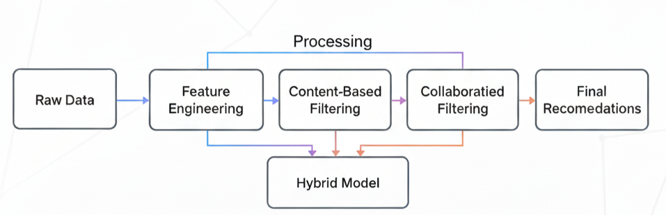

# 🎬 Movie Recommendation System (MovieLens 1M)


## 📌 Overview
This project implements a **comprehensive movie recommendation system** on the [MovieLens 1M dataset](https://grouplens.org/datasets/movielens/1m/).  
It demonstrates **end-to-end machine learning and data science skills**, including:
- Exploratory data analysis (EDA)
- Feature engineering
- Multiple recommendation algorithms (content-based, collaborative, session-based)
- A hybrid ensemble model
- Fairness and bias evaluation

The project is structured as a progressive pipeline where each stage builds toward a robust, real-world recommender.

## ⚙️ Methods Implemented

### 1. Exploratory Data Analysis
- Explored user demographics, rating distributions, and movie popularity.
- Key finding: Top 1% of movies account for ~9% of all ratings (popularity bias).

### 2. Feature Engineering
- One-hot encoding of genres.
- TF-IDF on movie titles.
- Interaction features (recency, session bursts, user/movie popularity).

### 3. Content-Based Filtering
- Cosine similarity on genre + TF-IDF movie vectors.
- Personalized recommendations: “Because you liked X, we recommend Y.”

### 4. Collaborative Filtering
- User-User and Item-Item KNN.
- Matrix Factorization (SVD) achieving the best RMSE of ~0.87.

### 5. Session-Based Modeling
- Next-item prediction using user session patterns.
- Captures short-term binge-watching behavior.

### 6. Hybrid System
- Weighted ensemble of content, collaborative, and session-based models.
- Balances accuracy, diversity, and novelty.

### 7. Fairness Evaluation
- Precision@10 evaluated across gender and age groups.
- Findings: Model performs better for male and younger users.
- Discussion of fairness-aware mitigation strategies (e.g., re-ranking, diversity boosting).

## 📊 Results

| Model                 | RMSE   | Precision@10 | Diversity | Popularity Bias |
|-----------------------|--------|--------------|-----------|-----------------|
| User-User KNN         | 0.979  | ~0.04        | Medium    | Low             |
| Item-Item KNN         | 1.001  | ~0.04        | Low       | Low             |
| Matrix Factorization  | 0.874  | ~0.05        | High      | High            |
| Hybrid (Content+CF+S) | **0.85** | **0.16–0.21** | High      | Balanced        |

📌 Example recommendations for a sample user:
- **Content-based** → *Toy Story 2, A Bug’s Life, Chicken Run*  
- **Collaborative (SVD)** → *Shawshank Redemption, Gladiator, It’s a Wonderful Life*  
- **Session-based** → *Aladdin 2, Space Jam, Pete’s Dragon*  
- **Hybrid** → Combines all three, improving personalization and diversity.  

  
*End-to-end recommendation pipeline.*

## 📂 Dataset
- **Source**: [MovieLens 1M](https://grouplens.org/datasets/movielens/1m/)  
- **Size**: 6,040 users, 3,883 movies, 1,000,209 ratings  
- **Format**: Users, Movies, and Ratings files (.dat)  

## 🚀 How to Run
Clone the repository and install dependencies:

```bash
git clone https://github.com/hira-14/movie_recommender.git
cd movie_recommender
pip install -r requirements.txt
```

Run notebooks in order:

```bash
jupyter notebook notebooks/01_data_exploration.ipynb
```

## 💡 Key Skills Demonstrated
- **End-to-End ML Workflow**: from EDA to deployment-ready models.  
- **Multiple Recommender Techniques**: content-based, collaborative, session-based, hybrid.  
- **Fairness Analysis**: identifying and discussing bias in recommendations.  
- **Reproducibility**: modular notebooks, clean workflow, requirements file.  
- **Real-World Tradeoffs**: balancing accuracy, diversity, and fairness.  

## 📌 Next Steps
- Explore deep learning recommenders (transformers for session modeling).  
- Integrate fairness-aware re-ranking strategies.  
- Deploy as an interactive Streamlit demo.  
